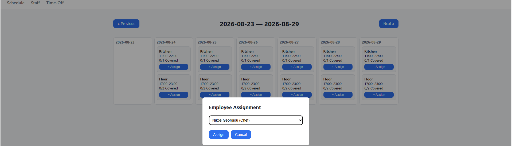
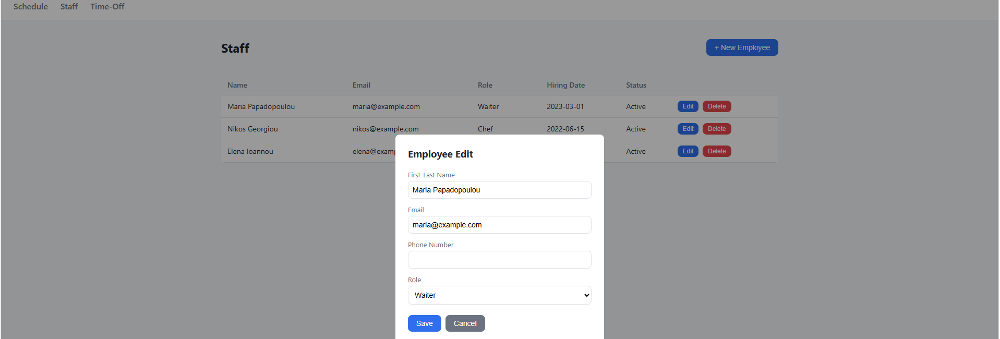
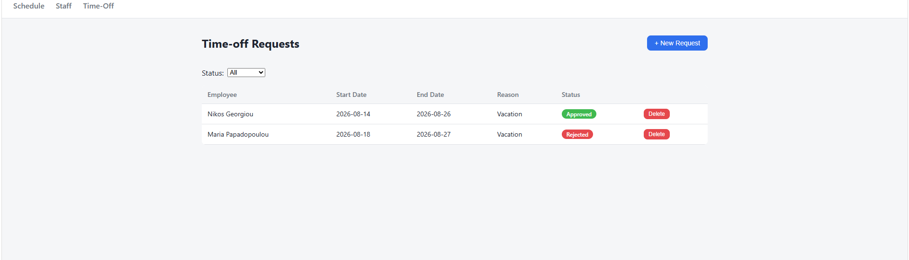

# Shift Management System

A staff shift scheduling application built for restaurant and hospitality
businesses. Managers can create shifts, track employee availability, assign
staff based on real-time eligibility checks, and manage time-off requests —
all through a lightweight web dashboard.

Built as a portfolio project with an emphasis on correct relational database
design and CRUD logic on top of real business rules, drawing on direct
industry experience in hospitality.

## Features

- **Employee management** — create, edit, deactivate, and remove staff
  records, each linked to a role (waiter, chef, bartender, etc.).
- **Shift scheduling** — define shifts by department, date, and time range,
  with a required headcount per shift.
- **Smart assignment** — a candidates endpoint filters staff down to those
  who are actually eligible for a given shift, checking:
  - declared weekly availability
  - conflicting assignments on the same day
  - approved time-off periods
- **Time-off requests** — employees submit requests; managers approve or
  reject them through a dedicated workflow (not a generic field update).
- **Weekly calendar dashboard** — browse shifts week by week and assign
  staff directly from the grid.

## Screenshots

**Weekly calendar with staff assignment**


**Staff management**


**Time-off approval workflow**


## Tech Stack

- **Backend:** Flask, Flask-SQLAlchemy
- **Database:** SQLite (swappable via `DATABASE_URL`)
- **Frontend:** vanilla JavaScript, Jinja2 templates, plain CSS
- **Architecture:** Flask application factory pattern with resource-based
  blueprints

## Database Design

Seven related tables model the domain:

| Table | Purpose |
|---|---|
| `Role` | Job role (waiter, chef, bartender...), optional hourly rate |
| `Department` | Where a shift takes place (kitchen, bar, floor...) |
| `Employee` | Staff member, linked to a `Role` |
| `Shift` | A schedulable slot: date, time range, department, required headcount |
| `ShiftAssignment` | Junction between `Employee` and `Shift`, carrying its own status (`assigned` / `confirmed` / `completed` / `no_show`) and check-in/out timestamps |
| `Availability` | Recurring weekly availability per employee (day of week + time range) |
| `TimeOffRequest` | Date-range leave request with an approval workflow |

The core design decision is the `ShiftAssignment` table: rather than a plain
many-to-many association, it's a full entity that tracks the lifecycle of an
assignment and enables real business logic (conflict detection, check-in
tracking) beyond simple linking.

## Project Structure

```
shift-management-system/
├── app/
│   ├── __init__.py          # application factory, blueprint registration
│   ├── models.py            # SQLAlchemy models
│   ├── scheduler.py         # eligibility/matching logic
│   ├── routes/
│   │   ├── employees.py
│   │   ├── shifts.py
│   │   ├── assignments.py
│   │   ├── availability.py
│   │   ├── time_off.py
│   │   ├── roles.py
│   │   └── views.py
│   ├── static/
│   │   ├── css/style.css
│   │   └── js/
│   │       ├── api.js
│   │       ├── calendar.js
│   │       ├── employees.js
│   │       └── time_off.js
│   └── templates/
│       ├── base.html
│       ├── dashboard.html
│       ├── employees.html
│       └── time_off.html
├── config.py
├── run.py
├── requirements.txt
└── .gitignore
```

## API Overview

| Resource | Endpoints |
|---|---|
| Employees | `GET/POST /api/employees`, `GET/PUT/DELETE /api/employees/<id>` |
| Shifts | `GET/POST /api/shifts`, `GET/PUT/DELETE /api/shifts/<id>` |
| Assignments | `GET /api/shifts/<id>/candidates`, `POST /api/shifts/<id>/assign`, `PATCH /api/assignments/<id>`, `PATCH /api/assignments/<id>/check-in` |
| Availability | `GET/POST /api/employees/<id>/availability`, `PUT/DELETE .../availability/<id>` |
| Time off | `GET/POST /api/time-off`, `PATCH /api/time-off/<id>/approve`, `PATCH /api/time-off/<id>/reject` |
| Roles | `GET /api/roles` |

## Getting Started

```bash
# 1. Create and activate a virtual environment
python -m venv venv
source venv/bin/activate  # Windows: venv\Scripts\activate

# 2. Install dependencies
pip install -r requirements.txt

# 3. (Optional) Populate the database with sample data
python seed.py

# 4. Run the app
python run.py
```

The app starts at `http://127.0.0.1:5000` and creates a local SQLite database
on first run.

## Author

Konstantinos Antoniou
[GitHub](https://github.com/AntoniouKonstantinos)
